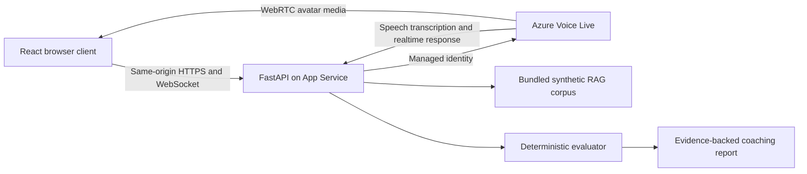

# EmpathyAI Avatar Demo

A reusable communication-practice application built with Azure Voice Live, `gpt-realtime-1.5`, Azure Speech transcription, semantic voice activity detection, and a synchronized photo avatar.

The application lets a learner speak with a synthetic patient or family-member persona, interrupt naturally, review an approximate live transcript, and receive deterministic, evidence-backed coaching. All bundled scenarios and grounding records are synthetic.

## What Is Included

- React 19, TypeScript, and Vite frontend
- Python FastAPI backend
- Same-origin WebSocket for microphone audio and control events
- Receive-only WebRTC avatar audio and video
- Azure Voice Live with `gpt-realtime-1.5`
- `azure-speech` input transcription
- Semantic VAD with interruption handling
- Bounded local RAG over approved synthetic communication examples
- Deterministic five-category coaching rubric
- Focused backend and frontend tests
- Bicep and Azure Developer CLI configuration

## Safety And Scope

This repository is a concept demo for synthetic communication practice. It is not clinical advice, a medical device, a competency assessment, or a production compliance claim.

Do not enter patient-identifying, employee-identifying, or other sensitive data. Raw microphone audio and raw transcripts are not persisted by the included implementation. Optional result persistence stores only the sanitized aggregate contract defined in the backend models.

## Architecture



The backend is the policy boundary. It owns model, voice, avatar, prompt, limits, grounding, and evaluation configuration. The browser does not receive a reusable Azure key.

## Repository Layout

```text
dev/
	backend/          FastAPI source, locked dependencies, and tests
	frontend/         React/Vite source and tests
	scripts/          Bootstrap, test, local-run, and packaging scripts
doc/                Required synthetic grounding corpus
infra/              Bicep deployment modules and parameters
azure.yaml          Azure Developer CLI project definition
```

Generated packages, frontend build output, virtual environments, local Azure environments, caches, and customer-specific documents are intentionally excluded.

## Prerequisites

- PowerShell 7+
- Python 3.12+
- Node.js 24+ and npm
- Azure CLI for Azure-connected local mode
- Azure Developer CLI for deployment
- An Azure subscription with access to the required Voice Live and model capabilities

## Run Locally In Mock Mode

From the repository root:

```powershell
pwsh ./dev/scripts/bootstrap.ps1
pwsh ./dev/scripts/run-mock.ps1
```

Open `http://localhost:8000`.

Mock mode uses scripted responses and does not require Azure configuration. It exercises the UI, transcript protocol, interruption flow, deterministic evaluator, and report.

## Run Locally With Azure

1. Create a local configuration file:

```powershell
Copy-Item ./dev/.env.example ./dev/.env.local
```

2. Set the non-secret endpoints and deployment names in `dev/.env.local`.

3. Sign in to Azure separately and select the intended subscription:

```powershell
az login
az account set --subscription <subscription-id>
```

4. Start Azure-connected mode. Passing `SubscriptionId` adds an explicit context check:

```powershell
pwsh ./dev/scripts/run-azure.ps1 -SubscriptionId <subscription-id>
```

The runtime uses `DefaultAzureCredential`; no API key or long-lived client secret is required by the included workflow.

## Test

Run the complete local validation suite:

```powershell
pwsh ./dev/scripts/test.ps1
```

For focused development:

```powershell
Set-Location ./dev/backend
./.venv/Scripts/python.exe -m pytest

Set-Location ../frontend
npm test
npm run build
```

## Package

Create the deployable application archive under `dev/artifacts/`:

```powershell
pwsh ./dev/scripts/package.ps1
```

The package script builds the frontend, copies only runtime files, generates a SHA-256 manifest, creates `empathy-avatar-demo.zip`, and performs a mock-mode smoke test unless explicitly skipped.

## Deploy With Azure Developer CLI

Review the Bicep defaults and confirm service availability, quota, region, budget, and role-assignment permissions before deployment. Resource names are derived from an environment-specific stable suffix.

```powershell
azd auth login
azd env new
pwsh ./dev/scripts/package.ps1
azd up
```

Set `BUDGET_CONTACT_EMAIL` in the Azure Developer CLI environment to deploy budget alerts. When it is empty, the budget module is skipped.

## Grounding And Scoring

The local corpus contains three approved synthetic reference moments per scenario. Retrieval is scenario-isolated and capped at three sources. Grounding helps calibrate persona reactions and coaching context; it does not provide clinical facts or directly modify the canonical score.

The current overall score sums five deterministic categories, each scored `0`, `1`, or `2`. These rules are demonstration defaults, not validated clinical thresholds. Organizations adopting this pattern should define and test their own dimensions, weights, critical-behavior guardrails, review process, and versioning policy.

## Configuration

Start with `dev/.env.example`. Important settings include:

- `APP_MODE`: `mock` or `azure`
- `AZURE_AI_ENDPOINT`
- `AZURE_REALTIME_DEPLOYMENT`
- `AZURE_TRANSCRIPTION_DEPLOYMENT`
- `AZURE_VOICELIVE_ENDPOINT`
- `AZURE_VOICELIVE_MODEL`
- `AZURE_VOICELIVE_TRANSCRIPTION_MODEL`
- `ALLOWED_ORIGINS`
- `PERSIST_RESULTS`
- `SESSION_MAX_MINUTES`

Keep local `.env` files and Azure Developer CLI environment files out of source control.
